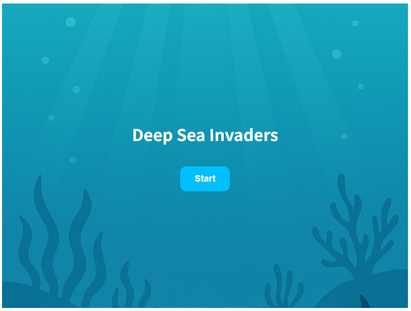
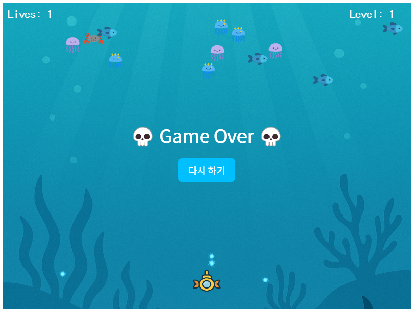
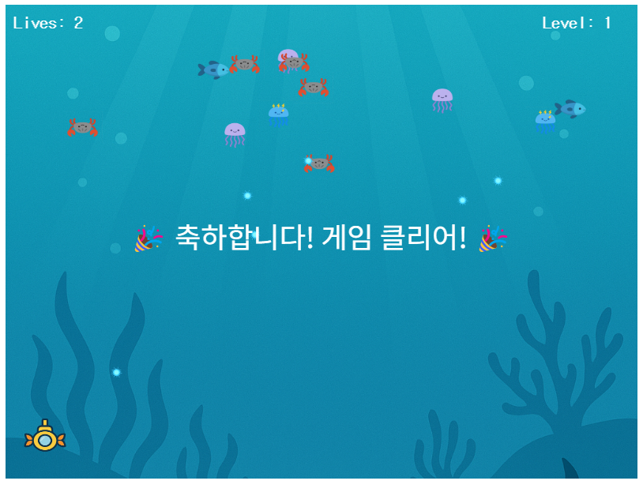

# 🌊 Deep Sea Invaders

잠수함을 조종하여 바닷속 적들을 무찌르는 HTML5 Canvas 기반 슈팅 게임입니다. 다양한 패턴의 적들과 보스가 등장하며, 점점 어려워지는 레벨을 클리어하는 것이 목표입니다.

## 🛠 개발 기간
- 2025년 4월 / 총 1주일

## 🧑개발 인원
- 1명

## 🕹️ 게임 소개

- 플레이어는 잠수함을 좌우로 이동하며 공격할 수 있습니다.
- 해파리, 전기 해파리, 갑옷 게 등 다양한 적이 등장합니다.
- 일정 웨이브를 클리어하면 강력한 꽃게 보스가 나타납니다.
- 레벨이 올라갈수록 적의 속도와 난이도가 증가합니다.
- 목숨이 모두 소진되면 게임 오버입니다.

## 🛠 사용 기술

- <b>HTML5</b> canvas API
- <b>CSS
- <b>JavaScript 

## 🎮 조작법

| 키 | 동작 |
|----|------|
| ←  | 왼쪽으로 이동 |
| →  | 오른쪽으로 이동 |
| Space | 총알 발사 |

## 📁 파일 구조

```
Deep-Sea-Invaders/
│
├── index.html       # 게임 화면 및 오디오 요소 포함
├── style.css        # 배경, UI, 버튼 등 시각 스타일 정의
├── script.js        # 게임 로직 및 적/보스/충돌 처리 등
├── images/          # 게임 이미지 리소스 (배경, 잠수함, 적, 보스 등등)
└── sounds/          # 게임 사운드 리소스 (총알, 폭발)
```

## 📸 게임 화면

### 시작 화면


### 게임 오버


### 게임 클리어

